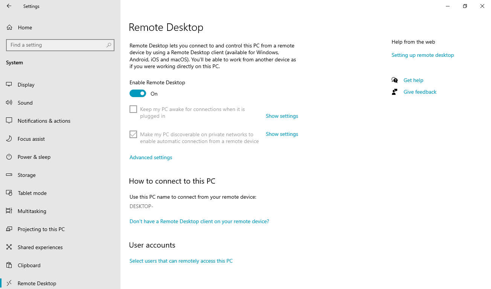
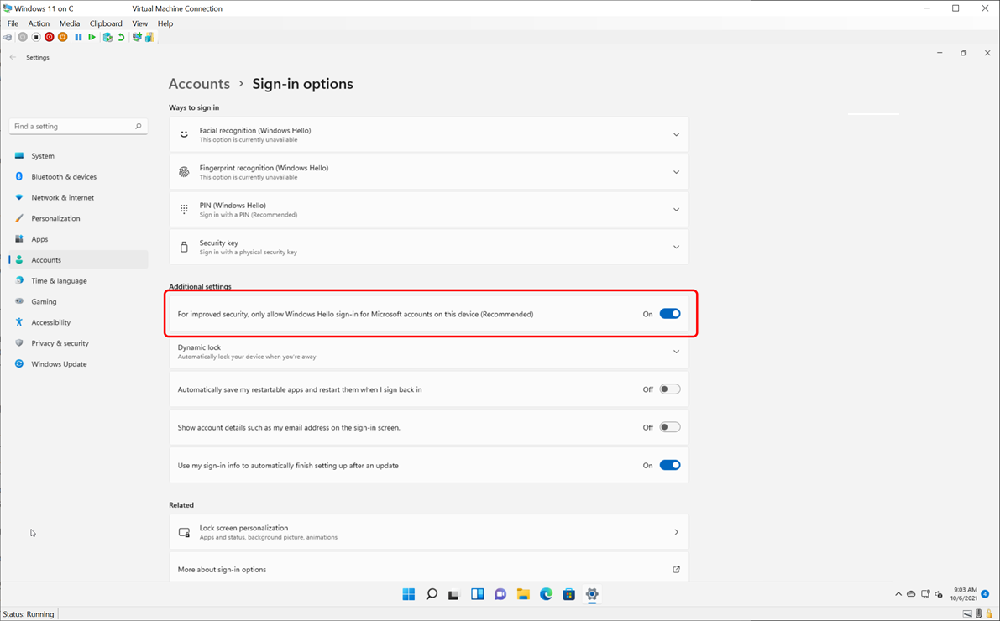
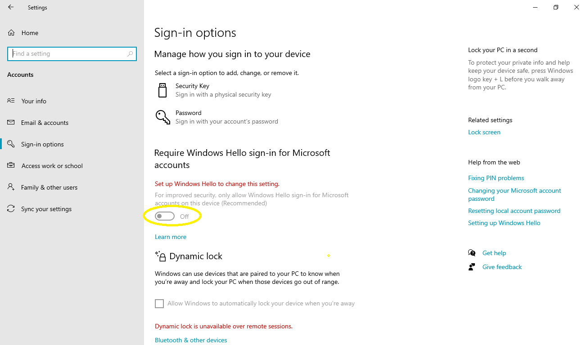

# Share devices with your virtual machine

> Only available for Windows virtual machines.

Enhanced Session Mode lets Hyper-V connect to virtual machines using RDP (remote desktop protocol).  Not only does this improve your general virtual machine viewing experience, connecting with RDP also allows the virtual machine to share devices with your computer.  Since it's on by default in Windows 10, you're probably already using RDP to connect to your Windows virtual machines.  This article highlights some of the benefits and hidden options in the connection settings dialogue.

RDP/Enhanced Session mode:

* Makes virtual machines resizable and high DPI aware.
* Improves virtual machine integration
  * Shared clipboard
  * File sharing via drag drop and copy paste
* Allows device sharing
  * Microphone/Speakers
  * USB devices
  * Data disks (including C:)
  * Printers

This article shows you how to see your session type, enter enhanced session mode, and configure your session settings.

## Check session type

You can check to see what type of connection you have using the Enhanced Session mode icon in the top of the Virtual Machine Connect tool (VMConnect).  This button also lets you toggle between basic session and enhanced session mode.


| icon | connection state |
|:-----|:---------|
|:::image type="icon" source="\hyper-v-on-windows\user-guide\media\esm-basic.png\>":::| You are currently running in enhanced session mode.  Clicking this icon will reconnect to your virtual machine in basic mode. |
|:::image type="icon" source="\hyper-v-on-windows\user-guide\media\esm-connect.png\>":::| You are currently running in basic session mode but enhanced session mode is available.  Clicking this icon will reconnect to your virtual machine in enhanced session mode.  |
|:::image type="icon" source="\hyper-v-on-windows\user-guide\media\esm-stop.png\>":::| You are currently running in basic mode.  Enhanced session mode isn't available for this virtual machine. |

## Configure VM for Remote Desktop

Enhanced Session Mode requires Remote Desktop to be enabled in the VM. Search for "Remote Desktop settings" in the Settings app or Start menu. Turn "Enable Remote Desktop" on.



Versions newer than Windows 10, version 2004 will requrire an additional setting, this includes Windows 11. If the Virtual Machine Connect window shows a background without a login prompt, then you need to make one more change.

First, log back in to the VM using Basic Mode. Search for "Sign-In Options" in the Settings app or Start menu. 
On this page, turn "Require Windows Hello sign-in for Microsoft accounts" off. 

| Windows 11 | Windows 10 |
|:----|:----|
|  |  |

Now, sign out of the VM or reboot before closing the Virtual Machine Connect window.

## Share drives and devices

Enhanced Session Mode's device sharing capabilities are hidden inside this inconspicuous connection window that pops up when you connect to a virtual machine:


By default, virtual machines using enhanced session mode will share clipboard and printers.  They are also configured by default to pass audio from the virtual machine back to your computer's speakers.

To share devices with your virtual machine or to change those default settings:

1. Show more options

  

1. View local resources

  

### Share storage and USB devices

By default, virtual machines using enhanced session mode share printers, the clipboard, pass smartcard and other security devices through to the virtual machine so you can use more secure login tools from your virtual machine.

To share other devices, such as USB devices or your C: drive, select the "More..." menu:  


From there you can select the devices you'd like to share with the virtual machine.  The system drive (Windows C:) is especially helpful for file sharing.  


### Share audio devices (speakers and microphones)

By default, virtual machines using enhanced session mode pass audio through so you can hear audio from the virtual machine.  The virtual machine will use the audio device currently selected on the host machine.

To change those settings or to add microphone passthrough (so you can record audio in a virtual machine):

Select the "Settings..." menu for configuring remote audio settings  


Now configure audio and microphone settings  


Since your virtual machine is probably running locally, the "play on this computer" and "play on remote computer" options will yield the same results.

## Re-launching the connection settings

If you aren't getting the resolution and device sharing dialogue box, try launching VMConnect independently from either the Windows menu or from the command line as Administrator.  

``` Powershell
vmconnect.exe
```
