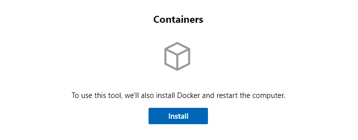
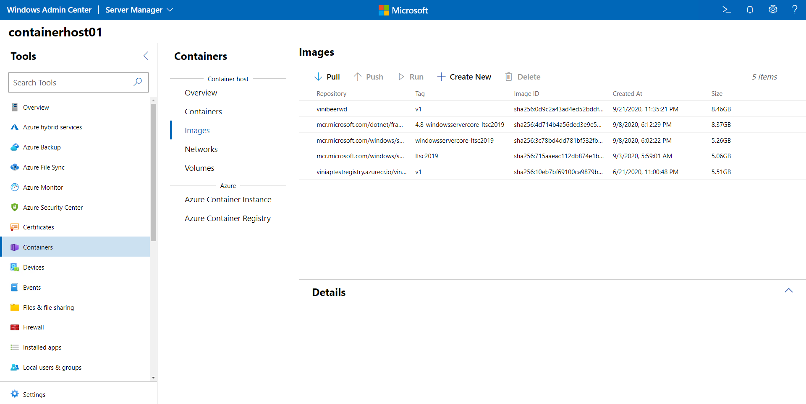

# Get started: Prep Windows for containers

> Applies to: Windows Server 2022, Windows Server 2019, Windows Server 2016, Windows 10 and 11

This tutorial describes how to:

- [Set up Windows 10/11 and Windows Server for containers](#prerequisites)
- [Build container-ready Azure VMs](#container-ready-azure-vms)
- [Install the Container Runtime](#install-the-container-runtime)
    - [Windows 10 & 11](#windows-10-and-11-1)
    - [Windows Admin Center](#windows-admin-center)
    - [Windows Server - Moby, Mirantis, & Containerd](#windows-server-1)
- [Run your first container image](./run-your-first-container.md)
- [Containerize a simple .NET core application](./building-sample-app.md)

## Prerequisites

### Windows 10 and 11

To run containers on Windows 10 or 11, you need the following:

- One physical computer system running Windows 10 or 11 Professional or Enterprise with Anniversary Update (version 1607) or later.
- [Hyper-V](/virtualization/hyper-v-on-windows/reference/hyper-v-requirements) should be enabled.

> [!NOTE]
> Starting with the Windows 10 October Update 2018, Microsoft no longer disallows users from running a Windows container in process-isolation mode on Windows 10 Enterprise or Professional for development ot test purposes. See the [FAQ](../about/faq.yml) to learn more.  

Windows Server Containers use Hyper-V isolation by default on Windows 10 and 11 to provide developers with the same kernel version and configuration that will be used in production. To learn more about Hyper-V isolation, see [Isolation Modes](../manage-containers/hyperv-container.md).

### Windows Server

For development environments, to run Windows Server Containers you will need a physical server or virtual machine running Windows Server.

For testing, you can download a copy of [Windows Server 2022 Evaluation](https://www.microsoft.com/evalcenter/evaluate-windows-server-2022 ) or a [Windows Server Insider Preview](https://insider.windows.com/for-business-getting-started-server/).

#### Container-Ready Azure VMs

For many applications and orchestration paradigms it is necessary to build and deploy your own custom VMs. With the [transition of support](https://techcommunity.microsoft.com/t5/containers/updates-to-the-windows-container-runtime-support/ba-p/2788799) for the Windows Container Runtime to Mirantis, the container runtime is no longer provided with a marketplace VM offering. The remainder of this guide details how you can build a VM for Azure with the container runtime installed and ready to go.

Ultimately, our goal is to remove the container runtime from the list of things customers need to worry about. We want the experience of managing application services to be painless. We believe the best way to do this is by offering a complete and fully managed end-to-end experience through the Azure Kubernetes Service both in the cloud and on-premises. AKS and AKS-HCI are fully managed services with lower management overhead than what you are used to with custom deployments. Support for the container runtime is included within the AKS and AKS-HCI services under your Azure subscription.

- [Getting Started with Windows on AKS](https://docs.microsoft.com/azure/aks/windows-container-cli)
- [Getting Started with Windows on AKS-HCI](https://docs.microsoft.com/azure-stack/aks-hci/kubernetes-walkthrough-powershell)

There are three things to keep in mind when considering the following options. It is up to your organization to decide which aspect you want to optimize around:

1.How complex is it to implement?
2.What is the cost?
3.How does it impact my workload in production?

Each of these methods are provided as an option to make the experience of constructing your container-ready Azure VMs as smooth as possible. The following subsections will detail the pros and cons of each option alongside how to get started.

> [!NOTE]
> It is recommended when setting up your own VMs that you cache your container images at build time to prevent pull delays at run time.

##### Azure Image Builder

The benefit to using Image Builder is that the configuration is done during a build time and would not have any effect on
your workload at runtime; when the VM scale set instantiates a new VM from your custom image, the image will have already
been prepped so no time must be spent here and it will be immediately ready to run containers.

Azure image builder, however, can be more complex to implement and there are more steps involved than with script extensions. Additionally, while the Image Builder service is free, you must manage for the compute, storage, and networking usage associated with the build process (additional details [here](https://docs.microsoft.com/azure/virtual-machines/image-builder-overview#costs))

To get started with building your own Windows Server VM image, we have [created a guide which details the process step-by step](https://docs.microsoft.com/azure/virtual-machines/windows/image-builder). The powershell scripts mentioned below can be utilized alongside this guide to install your container runtime of choice.

> [!TIP]
> Make sure to cache the container images you plan to use locally on the VM! This will help improve the container start time after deployment. The [scripts below](#windows-server-1) will help you do this.

##### Custom Script Extensions

Custom Script Extensions are quicker to implement and the cost is only in the nominal price to store the script in Azure or GitHub. However, the script may only execute after a VM has been provisioned, so you must budget for additional time being spent to properly prep the VM at scale-out time.

Using the scripts offered below you can configure your VM scale sets to install the container runtime of your choice upon provisioning. [Follow our guide](http://ttps//docs.microsoft.com/azure/virtual-machine-scale-sets/tutorial-install-apps-cli) learn how to set a custom script extension.

## Install the Container Runtime

### Windows 10 and 11

You can install Docker on Windows 10 or 11 Professional and Enterprise editions by using the following steps.

1. Download and install [Docker Desktop](https://store.docker.com/editions/community/docker-ce-desktop-windows) and create a Docker account if you don't already have one. You can create a free Docker account for personal or small business users, however, for larger businesses, there is a monthly fee. For more details, see the [Docker documentation](https://docs.docker.com/docker-for-windows/install).

2. During installation, set the default container type to Windows containers. To switch after installation completes, you can use either the Docker item in the Windows system tray (as shown below), or the following command in a PowerShell prompt:

   ```console
   & $Env:ProgramFiles\Docker\Docker\DockerCli.exe -SwitchDaemon .
   ```

   

### Windows Admin Center

You can use Windows Admin Center to properly set up a Windows Server machine as a container host. To get started, ensure you have the latest Containers extension installed on your Windows Admin Center instance. For more information on how to install and configure extensions, check out the Windows Admin Center [documentation](/windows-server/manage/windows-admin-center/overview). With the Containers extension installed, target the Windows Server machine you want to configure and select the Containers option:



Click the **Install** button. Windows Admin Center will start the configuration of Windows Server and Docker in the background. After the process is complete, you can refresh the page and see the other functionalities of the Containers extension.

  

### Windows Server
To run a Windows container you must have a supported container runtime available on your machine. The runtimes currently supported on Windows are [containerd](https://kubernetes.io/docs/setup/production-environment/container-runtimes/#containerd), [Moby](https://mobyproject.org/), and the [Mirantis Container Runtime](https://info.mirantis.com/docker-engine-support).

This section will detail the process of installing each on your specific copy of Windows, including a set of powershell scripts which make it easy to install each runtime in just a few steps.

<!-- start tab view -->
# [Docker CE / Moby](#tab/dockerce)

Docker Community Edition (CE) provides a standard runtime environment for containers with a common API and command-line interface (CLI). It is managed by the open source community as part of the [Moby Project](https://mobyproject.org/).

To get started with Docker on Windows Server we have created [a powershell script](https://raw.githubusercontent.com/microsoft/Windows-Containers/Main/helpful_tools/Install-DockerCE/install-docker-ce.ps1) which configures your environment to enable container-related OS features and install the Docker runtime.

```powershell
Invoke-WebRequest -UseBasicParsing "https://raw.githubusercontent.com/microsoft/Windows-Containers/Main/helpful_tools/Install-DockerCE/install-docker-ce.ps1" -o install-docker-ce.ps1
install-docker-ce.ps1
```

For more configuration details, see [Docker Engine on Windows](../manage-docker/configure-docker-daemon.md).

# [Mirantis Container Runtime](#tab/mirantiscontainerruntime)

The Mirantis Container Runtime, formally known as Docker EE, provides the same functionality as Docker CE plus extra features built specifically for enterprise deployments.

[Included here is a script](https://raw.githubusercontent.com/microsoft/Windows-Containers/Main/helpful_tools/Install-MirantisContainerRuntime/install-mirantis-container-runtime.ps1) which calls the Mirantis Container Runtime [installation script](https://docs.mirantis.com/mcr/20.10/install/mcr-windows.html) and reboots the computer.

```powershell
Invoke-WebRequest -UseBasicParsing "https://raw.githubusercontent.com/microsoft/Windows-Containers/Main/helpful_tools/Install-MirantisContainerRuntime/install-mirantis-container-runtime.ps1" -o install-mirantis-container-runtime.ps1
install-mirantis-container-runtime.ps1
```

Please head over to the [Mirantis site](https://www.mirantis.com/software/container-runtime/) for more information.

# [Containerd](#tab/containerd)

[Containerd](https://github.com/containerd/containerd) is an industry-standard container runtime with an emphasis on simplicity, robustness and portability. It is available as a daemon for Linux and Windows, which can manage the complete container lifecycle of its host systemW: image transfer and storage, container execution and supervision, low-level storage and network attachments, etc.

[nerdctl](https://github.com/containerd/nerdctl) is a Docker-compatible CLI for containerd.

We have created [an installation script](https://raw.githubusercontent.com/microsoft/Windows-Containers/Main/helpful_tools/Install-ContainerdRuntime/install-containerd-runtime.ps1) which installs both for you at the same time alongside container related OS features.
```powershell
Invoke-WebRequest -UseBasicParsing "https://raw.githubusercontent.com/microsoft/Windows-Containers/Main/helpful_tools/Install-ContainerdRuntime/install-containerd-runtime.ps1" -o install-containerd-runtime.ps1
install-containerd-runtime.ps1
```

This script does install the [Windows CNI plugins](https://github.com/microsoft/windows-container-networking) as well, however, you will need to configure ctr/nerdctl to use the CNI configuration that best suits you.

- [Instructions for installing containerd on Windows.](https://github.com/containerd/containerd/blob/main/docs/getting-started.md#installing-containerd-on-windows)
- [Instructions on how to install and configure containerd](https://www.jamessturtevant.com/posts/Windows-Containers-on-Windows-10-without-Docker-using-Containerd/#setting-up-network)
- [Instructions for installing nerdctl on Windows.](https://github.com/containerd/nerdctl#install)
- [More advanced community installer for containerd](https://github.com/lippertmarkus/containerd-installer)

---
<!-- stop tab view -->

## Next steps

> [!NOTE]
> If you have read this guide and would like additional guidance from the Windows Containers product team, you can reach us at [github/Windows-Containers](https://github.com/microsoft/Windows-Containers) where you will find information about getting time on the product team’s calendar to chat.

Now that your environment has been configured correctly, follow the link to learn how to run a container.

> [!div class="nextstepaction"]
> [Run your first container](./run-your-first-container.md)
