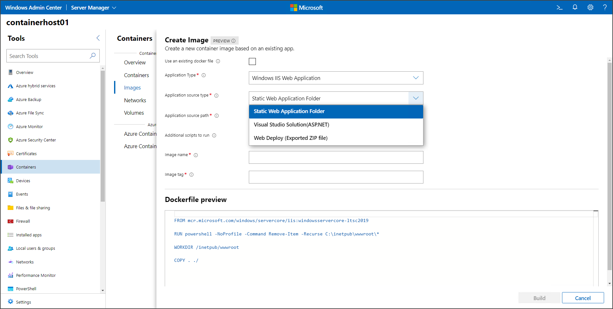

# Create new container images on Windows Admin Center

This topic describes how to create new container images using Windows Admin Center. Container images are used to create new containers on Windows machines or other cloud services, such as Azure Kubernetes Service. For more information on Windows images, see the [Container images overview](../about/index.md#container-images).

## Create new container images

When working with containers, you'll write instructions to Docker on how your container image works, and then Docker creates a new container image based on these instructions. These instructions are saved on a file called "Dockerfile" that's saved to the same folder in which your application resides.

Windows Admin Center can considerably reduce the overhead of writing Dockerfiles or even remove the need to write these files entirely. To get started, on the **Containers** extension, select the **Create New** option on the **Images** tab.

When creating a new container image, you have different options to choose from:

- **Use an existing Dockerfile**: This option allows you to rebuild a new container image based on an existing Dockerfile. This is useful when you need to make small changes to an existing Dockerfile or when you need to recreate the container to catch an application update.
- **IIS web application/static web application folder**: Use this option to create a new container image using the IIS base image. The folder's content is copied to the container image to add it as a web site. No framework is added with this option.
- **IIS web application/Visual Studio solution (ASP.NET)**: Use this option to create a new container image based on an existing Visual Studio solution. This option uses a multi-image stage approach to stage the application, compile the necessary binaries, and store only the necessary assets on the final image. The ASP.NET container image is used as the base image. This option also asks for the folder on which the Visual Studio resides. This lets you can see a list of the existing projects, and you can select the one you'd like to containerize.
- **IIS web application/Web Deploy (exported Zip file)**: Use this option to create a container image from the artifacts exported from a running server. You can use Web Deploy to export the application into a Zip file and then use Windows Admin Center to create a new container image based on the exported Zip file. The ASP.NET container image is used as the base image.

Once you select the type of application you want to containerize, you can select common options to finalize the creation of your image:

- **Framework version**: Both the Visual Studio solution and Web Deploy options use the ASP.NET image as the base for your container image. However, you can select which version of the .NET Framework you want to use to accommodate your application.
- **Additional scripts to run**: This option allows you to select a PowerShell script to use at build time. Windows Admin Center adds an instruction to the Dockerfile to copy the .PS1 file to the container image and then run this script when the container image is created. This can be helpful if your application requires you to run any additional steps that are not completed in the application itself.
- **Image name**: The final image name to be used. You can change the name later when you push the image to a container registry.
- **Image tag**: The tag is used to differentiate between multiple versions of the same image. Provide a identifier, so your image is properly tagged.

Once you have selected all the options for your container image, you can review the Dockerfile. If necessary, you can also manually edit the Dockerfile. This Dockerfile is saved to the location of the application you specified in an earlier step.

>[!Note]
>If a Dockerfile already exists in the location of the application you are trying to containerize, Windows Admin Center will replace that file with the new one it just created.

## Next steps

> [!div class="nextstepaction"]
> [Run containers on Windows Admin Center](./wac-containers.md)